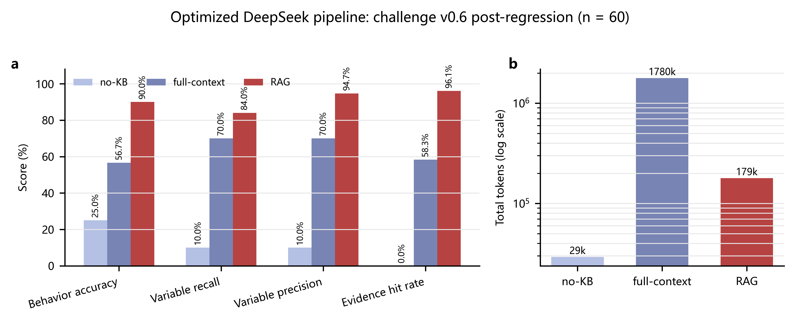
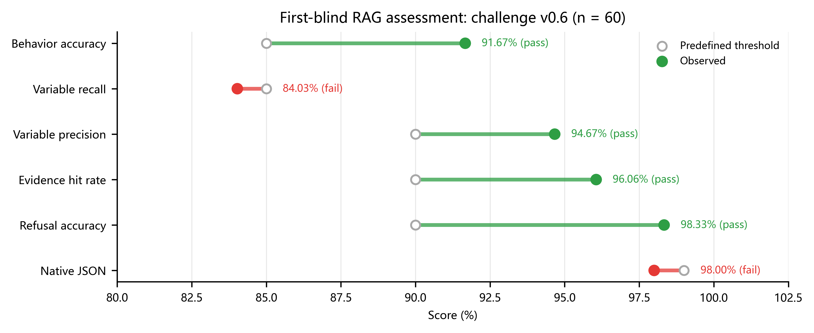
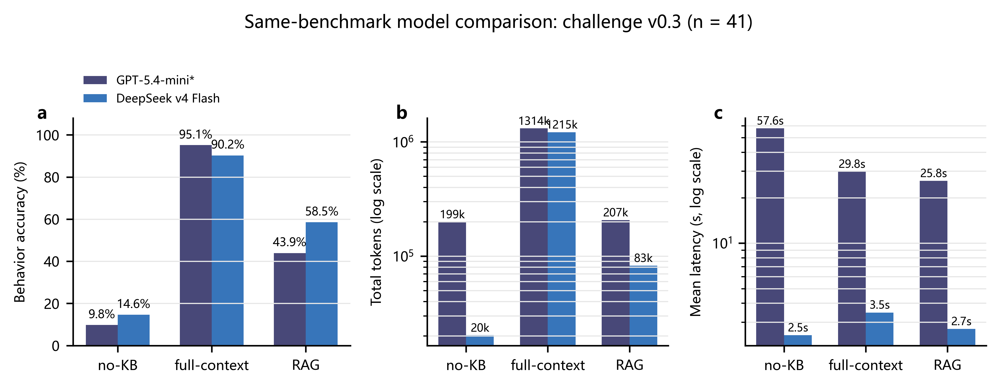

# STORM PySC2 Raw API Variable Knowledge Base

  <strong>面向 StarCraft II 智能体、论文写作与代码开发的源码证据型变量知识库</strong>

  
  
  
  
  

> **当前版本：0.1.0（2026-09-08）**
>
> 本知识库已经可以用于自然语言变量检索、LLM 上下文增强、代码定位和论文变量释义。当前推荐使用 **RAG**，但 challenge v0.6 的唯一首次盲测仍有两项预设门槛未通过，因此项目状态保持 <code>conditional_go</code>，不宣称已经解决全部泛化问题。

---

## 目录

- [项目简介](#项目简介)
- [核心能力](#核心能力)
- [覆盖范围与规模](#覆盖范围与规模)
- [知识库数据流](#知识库数据流)
- [快速开始](#快速开始)
- [如何交给 LLM Agent 使用](#如何交给-llm-agent-使用)
- [评测设计](#评测设计)
- [评测结果](#评测结果)
- [结果应该如何解释](#结果应该如何解释)
- [仓库结构](#仓库结构)
- [事实与证据规则](#事实与证据规则)
- [复现评测图](#复现评测图)
- [已知限制](#已知限制)
- [贡献与维护](#贡献与维护)
- [引用与许可证](#引用与许可证)

---

## 项目简介

STORM 是一个基于 PySC2 的 StarCraft II LLM 战术决策项目。研究者在阅读代码、设计实验或编写论文时，经常需要快速回答下面的问题：

- “单位当前血量对应哪个 RawUnit 字段？”
- “护盾比例由哪些变量计算？”
- “ABox 中的单位位置来自哪里？”
- “动作目标坐标、单位 tag 和延迟分别如何表示？”
- “某个 SWM 指标的名字和实际公式是否一致？”
- “这个变量是代码真实使用的，还是 README 中的设计描述？”

通用大模型通常不了解特定 STORM 版本的内部实现，也可能把 PySC2 官方语义、项目设计意图和当前代码现实混在一起。本项目将当前 STORM 主路径中的变量整理为可追溯的结构化知识，使 LLM Agent 能够：

1. 根据自然语言定位标准变量；
2. 解释变量的物理或游戏含义；
3. 返回接口形式、数据类型、形状、范围和枚举；
4. 定位 STORM 中的源码文件、类、函数和语句；
5. 展开变量的来源、映射、公式和下游用途；
6. 给出与结论直接绑定的代码证据；
7. 识别歧义、范围外问题和仍需验证的事实；
8. 为论文写作和代码开发提供同一套事实底座。

本项目不是一份单纯的变量说明文档，而是由 **结构化变量数据、别名词典、关系图、检索器、QA Agent、评测集和发布验证工具** 共同组成的知识系统。

---

## 核心能力

| 能力 | 说明 |
|---|---|
| 自然语言检索 | 支持中文、英文、代码字段、缩写和口语表达 |
| 变量标准化 | 将“当前血量”“unit hp”等表达统一映射到稳定变量 ID |
| 接口说明 | 返回 PySC2 路径、STORM 路径、类型、形状、范围和枚举 |
| 源码证据 | 记录源码相对路径、符号、行号、代码片段和事实状态 |
| 关系展开 | 支持来源、映射、归一化、派生、验证和动作执行关系 |
| 公式依赖 | 公式变量可展开到输入变量、计算结果和跨层映射 |
| 变量族检索 | 支持动态多变量、同类字段和跨层变量组召回 |
| 范围识别 | 对 Feature Layer、完整 SC2 百科等 V0.1 范围外问题进行拒答 |
| LLM 上下文 | 提供 short、standard、full 和检索式 RAG 上下文 |
| 自动评测 | 支持 no-KB、full-context、RAG 三条件比较和冻结挑战集 |
| 离线验证 | 无需模型 API 即可检查 Schema、关系、证据和检索回归 |

---

## 覆盖范围与规模

V0.1 只覆盖 **当前 STORM 代码实际读取、转换、生成、校验或使用的 PySC2 Raw API 变量及其直接下游变量**。

### 当前规模

| 项目 | 数量 |
|---|---:|
| 正式变量记录 | 135 |
| 变量关系 | 1,430 |
| 已知问题 | 11 |
| 变量数据文件 | 7 类 |
| 发布版本 | 0.1.0 |

### 七类变量

- <code>raw_api</code>：PySC2 Raw Observation、RawUnit 和 Player 字段；
- <code>tbox</code>：单位类型和静态本体知识；
- <code>abox</code>：当前战场中的动态实体和属性；
- <code>derived</code>：比例、距离、计数和战术摘要等派生变量；
- <code>actions</code>：动作类型、坐标、目标 tag、优先级和延迟；
- <code>swm</code>：世界模型输入、预测和相关指标；
- <code>metrics</code>：奖励、胜率、实验统计和评测指标。

### 暂不覆盖

- 完整 PySC2 API；
- Feature Layer 全字段；
- 完整 StarCraft II 单位、地图和科技百科；
- 当前 STORM 主路径没有使用的接口；
- 无源码或可靠证据支持的推测性语义；
- 游戏素材、客户端或 Blizzard 资产。

---

## 知识库数据流

~~~mermaid
flowchart LR
    A[PySC2 Observation] --> B[RawUnit / Player]
    B --> C[RawAgent parsing]
    C --> D[BattlefieldGraph]
    D --> E[TBox static knowledge]
    D --> F[ABox runtime instances]
    E --> G[Derived tactical state]
    F --> G
    G --> H[Retriever / RAG context]
    H --> I[LLM QA Agent]
    I --> J[Structured answer + evidence]
    I --> K[ResponseParser]
    K --> L[ActionExecutor]
    L --> M[PySC2 Raw Action]
~~~

变量知识保留完整血缘，例如：

~~~text
raw_unit.health
    ├── mapped_to      → abox.unit.hp
    ├── normalized_to  → derived.health_ratio
    └── source_of      → tactical health summary

action.target_unit_tag
    ├── validated_by   → ResponseParser
    └── executed_as    → PySC2 Raw FunctionCall
~~~

---

## 快速开始

### 1. 克隆仓库

~~~bash
git clone https://github.com/darlinlecc123/sc2-knowledge-base.git
cd sc2-knowledge-base
~~~

### 2. 安装最小依赖

~~~bash
python -m pip install -r requirements-minimal.txt
~~~

当前最小运行依赖只有 PyYAML。建议使用 Python 3.11 或更高版本。

### 3. 设置 Python 路径

Windows PowerShell：

~~~powershell
$env:PYTHONPATH = "src"
$env:PYTHONIOENCODING = "utf-8"
~~~

Linux/macOS：

~~~bash
export PYTHONPATH=src
export PYTHONIOENCODING=utf-8
~~~

### 4. 自然语言查询

~~~powershell
python -m sc2kb.cli --limit 3 --json "单位当前血量对应哪个字段"
~~~

预期首个结果：

~~~json
{
  "status": "found",
  "variable_id": "raw_unit.health",
  "canonical_name": "health",
  "pysc2_path": "obs.observation.raw_units[*][2]",
  "storm_path": "parsed_raw_unit.health"
}
~~~

实际完整结果还会包含：物理含义、源码位置、转换公式、上下游关系、已知问题和验证状态。

### 5. Python API

~~~python
from sc2kb.search import search

result = search("护盾比例如何计算", limit=5)

print(result["status"])
for item in result["results"]:
    print(item["variable_id"], item["score"])
~~~

### 6. QA Agent 离线 dry-run

~~~powershell
python -m sc2kb.qa_agent "单位当前血量对应哪个字段" --dry-run --json
~~~

<code>dry-run</code> 不调用外部模型，只输出检索候选、grounding 证据和准备发送给 LLM 的消息。只有显式使用 <code>--call-model</code> 并提供非敏感配置时才会请求模型 API。

---

## 如何交给 LLM Agent 使用

本项目支持三种接入方式。

### 方式一：直接注入静态上下文

| 文件 | 用途 |
|---|---|
| <code>context/sc2_raw_api_context_short.md</code> | 快速问答和较小上下文窗口 |
| <code>context/sc2_raw_api_context_standard.md</code> | 一般变量解释和代码定位 |
| <code>context/sc2_raw_api_context_full.md</code> | 全量审阅和离线分析 |
| <code>context/sc2_raw_api_context_full_compact_v2.jsonl</code> | 机器读取和批量上下文构建 |
或者直接将
storm-sc2kb-0.1.0-full.zip
storm-sc2kb-0.1.0-minimal.zip中的一个压缩包注入GPT等在线大模型中进行指令查询

### 方式二：推荐的 RAG 接入

~~~text
用户问题
  → 本地 SearchEngine 检索
  → 变量族、公式和关系图展开
  → 生成小型 grounding 上下文
  → LLM 生成结构化答案
  → 检查变量引用和证据绑定
~~~

RAG 更适合长期维护，因为它不会把全部变量一次性塞入上下文。

### 方式三：使用 QAAgent Python 接口

~~~python
from sc2kb.qa_agent import QAAgent

agent = QAAgent(context_profile="short")
result = agent.ask(
    "ABox 中的单位生命值来自哪个 RawUnit 字段？",
    dry_run=True,
    limit=5,
)

print(result["candidate_variable_ids"])
print(result["grounding"])
~~~

更完整示例见 [查询手册](docs/query_cookbook.md) 和 [数据流说明](docs/dataflow.md)。

---

## 评测设计

评测使用三种知识条件，避免把模型自身能力误认为知识库能力。

| 条件 | 给模型的知识 | 评测目的 |
|---|---|---|
| **no-KB** | 不提供项目知识库 | 测量模型仅依靠预训练知识的能力 |
| **full-context** | 一次性提供完整知识上下文 | 测量有知识但不检索时的效果和成本 |
| **RAG** | 只提供检索得到的变量与证据 | 测量检索增强后的准确性、证据性和 Token 效率 |

主要指标：

- **Behavior accuracy**：回答、澄清、拒答等行为是否符合预期；
- **Variable hit rate / recall**：应返回的目标变量是否被召回；
- **Variable precision**：返回变量中真正相关的比例；
- **Evidence hit rate**：是否命中要求的源码证据；
- **Refusal accuracy**：范围外或证据不足问题是否正确拒答；
- **Native JSON compliance**：模型是否直接返回符合协议的 JSON；
- **Total tokens**：整组实验的 Token 消耗；
- **Model errors**：调用失败、空响应或解析失败数量。

为降低调参泄漏，开发集用于优化；challenge 集在冻结后保留题目与文件哈希，并限定首次盲测纪律。challenge v0.6 包含 60 道题，其首次盲测只完整执行一次，之后只能作为回归集。

---

## 评测结果

> 数据来自 2026-09-07 汇总的正式评测与审计结果。详细报告、源数据哈希和复现说明见 [多模型测试报告](reports/multi_model_evaluation/multi_model_test_report.md)。本 README 没有重新调用模型 API。

### 1. 优化后 DeepSeek 三条件对照：challenge v0.6

| 条件 | 行为准确率 | 变量召回率 | 变量精确率 | 证据命中率 | 总 Token | 模型错误 |
|---|---:|---:|---:|---:|---:|---:|
| no-KB | 25.00% | 10.00% | 10.00% | 0.00% | 29,271 | 16 |
| full-context | 56.67% | 70.00% | 70.00% | 58.33% | 1,779,558 | 20 |
| **RAG** | **90.00%** | **84.03%** | **94.67%** | **96.06%** | **178,867** | **2** |

  

**主要观察：**

- RAG 行为准确率比 full-context 高 **33.33 个百分点**，比 no-KB 高 **65.00 个百分点**；
- RAG 相对 full-context 节省 **89.95% Token**；
- full-context 使用约 178 万 Token，并出现 20 个模型错误；
- RAG 的变量精确率达到 94.67%，主要剩余问题是多变量问题的漏召回，而不是大量无关变量污染。

### 2. challenge v0.6 唯一首次盲测

回归对照可以展示优化后的表现，但是否达到预先约定的“有效 RAG”标准，要看冻结题集的唯一首次盲测。

| 指标 | 实测值 | 预设门槛 | 判定 |
|---|---:|---:|---|
| Behavior accuracy | **91.67%** | ≥ 85.00% | 通过 |
| Variable hit rate | **84.03%** | ≥ 85.00% | **未通过** |
| Variable precision | **94.67%** | ≥ 90.00% | 通过 |
| Evidence hit rate | **96.06%** | ≥ 90.00% | 通过 |
| Refusal accuracy | **98.33%** | ≥ 90.00% | 通过 |
| Native JSON compliance | **98.00%** | ≥ 99.00% | **未通过** |

  

六项门槛中有四项通过；变量召回率低 0.97 个百分点，原生 JSON 合规率低 1.00 个百分点。因此当前准确结论是：

> **知识库和 RAG 已表现出明显实用价值，但尚未同时通过全部预设有效性门槛。**

### 3. 同题集跨模型比较：challenge v0.3

challenge v0.3 共 41 题，用于比较 DeepSeek v4 Flash 与第三方中转接口声明的 GPT-5.4-mini。

| 条件 | GPT-5.4-mini* 行为准确率 | DeepSeek v4 Flash 行为准确率 |
|---|---:|---:|
| no-KB | 9.76% | 14.63% |
| full-context | **95.12%** | 90.24% |
| 旧版 RAG | 43.90% | **58.54%** |

  

* GPT-5.4-mini 的模型身份来自第三方中转配置及 <code>response.model</code> 元数据，无法独立证明真实后端。challenge v0.3 使用的是较早版本 RAG，因此不能与优化后的 v0.6 RAG 数值直接横向比较，也不能据此得出“某模型在最新版 RAG 上更强”的结论。

---

## 结果应该如何解释

### 可以支持的结论

1. **项目知识库是必要的。** no-KB 无法稳定识别 STORM 专用变量，也不能提供可靠源码依据。
2. **RAG 是当前推荐接入方式。** 在 v0.6 回归对照中，它同时提高回答质量、证据命中率和 Token 效率。
3. **完整上下文不等于稳定。** 上下文过长会引入高 Token 成本、格式修复和模型错误。
4. **当前系统具备实际使用价值。** 行为准确率、证据命中率和范围外拒答均已达到较高水平。

### 不能支持的结论

1. 不能宣称 challenge v0.6 全部门槛已经通过；
2. 不能把 RAG 系统指标全部归因于生成模型；
3. 不能把第三方中转的模型名称视为独立验证的真实后端身份；
4. 不能把静态源码证据自动提升为真实 SC2 运行观察；
5. 不能用已经暴露的 v0.6 再次证明无偏泛化，新结论需要冻结全新 challenge v0.7。

---

## 仓库结构

~~~text
.
├── variables/          # 七类正式变量记录
├── schemas/            # JSON Schema
├── taxonomy/           # 分类与命名规范
├── manifests/          # 范围、源码和版本清单
├── lineage/            # 数据来源与生命周期
├── relations/          # 变量关系图
├── retrieval/          # 别名、语义规则和检索数据
├── context/            # short / standard / full / compact 上下文
├── src/sc2kb/          # 加载器、检索器、QA Agent 和模型客户端
├── evals/              # 开发集、冻结 challenge 和评测脚本
├── tests/              # 离线验证与回归测试
├── reports/            # 评测、验收和发布报告
├── docs/               # 变量目录、数据流、术语表和查询手册
├── prompts/            # 步骤化知识库制作提示词
├── release/            # 发布 manifest
├── known_issues.yaml   # 已知实现差异与验证需求
├── CITATION.cff
├── CHANGELOG.md
└── LICENSE
~~~

### 推荐阅读顺序

1. [知识库首页](docs/index.md)
2. [变量目录](docs/variable_catalog.md)
3. [数据流说明](docs/dataflow.md)
4. [查询手册](docs/query_cookbook.md)
5. [术语表](docs/glossary.md)
6. [多模型测试报告](reports/multi_model_evaluation/multi_model_test_report.md)
7. [内部验收清单](reports/19_acceptance_checklist.md)
8. [开放问题](reports/19_open_issues.md)

---

## 事实与证据规则

每条变量事实都应标记其知识状态：

| 状态 | 含义 |
|---|---|
| <code>design_intent</code> | 设计目标或文档声称的行为 |
| <code>code_reality</code> | 当前源码实际执行的行为 |
| <code>runtime_observation</code> | 已由真实运行或测试观测的事实 |
| <code>needs_verification</code> | 尚需固定版本、官方定义或真实 SC2 环境验证 |

证据优先级：

~~~text
当前 STORM 源码
  > 本地 PySC2 源码与版本数据
  > SC2 API / protobuf 定义
  > 项目文档
  > 旧版说明材料
~~~

当设计描述与代码实现不一致时，本知识库优先报告 <code>code_reality</code>，同时保留设计意图、风险和建议验证方法。

---

## 复现评测图

评测图由已有结果文件离线生成，不会调用外部模型 API：

~~~powershell
python reports/multi_model_evaluation/generate_report_figures.py
~~~

派生数据：

- <code>reports/multi_model_evaluation/data/model_comparison_challenge_v0.3.csv</code>
- <code>reports/multi_model_evaluation/data/deepseek_challenge_v0.6_three_conditions.csv</code>
- <code>reports/multi_model_evaluation/data/challenge_v0.6_blind_thresholds.csv</code>
- <code>reports/multi_model_evaluation/data/source_hashes.json</code>

图同时提供 PNG、SVG、PDF 和 TIFF 格式。README 使用 PNG，论文排版建议使用 SVG、PDF 或 TIFF。

---

## 已知限制

- 当前只覆盖 STORM 使用的 Raw API 路径，不是完整 PySC2 文档；
- 部分 RawUnit 位置索引仍需结合固定 PySC2 版本核验；
- ontology pickle 可能与 Python 本体定义不同步；
- 部分字段存在“设计意图”和“代码现实”差异；
- full-context 在现有评测中出现较高 Token 消耗和模型错误；
- 多变量族、跨层同名变量和公式依赖仍有漏召回空间；
- Windows 默认 GBK 终端可能造成中文或数学符号乱码，建议设置 <code>PYTHONIOENCODING=utf-8</code>；
- 现有正式模型结果主要是固定题集单次运行，尚缺多随机种子和置信区间；
- GPT-5.4-mini 结果存在第三方中转身份限制；
- challenge v0.6 已经暴露，未来无偏泛化评测应使用全新冻结题集。

完整清单见 [known_issues.yaml](known_issues.yaml) 和 [开放问题报告](reports/19_open_issues.md)。

---

## 贡献与维护

欢迎研究者提交变量补充、证据修正、检索规则、测试题和文档改进。

新增或修改变量时，请至少提供：

1. 稳定变量 ID 和所属层级；
2. 中文、英文和代码名称；
3. 物理或游戏含义；
4. PySC2/STORM 接口形式；
5. 数据类型、形状、单位、范围或枚举；
6. 当前 STORM 源码路径和符号；
7. 来源、映射、公式和下游关系；
8. 自然语言别名与歧义反例；
9. 事实状态和仍需验证的内容；
10. Schema、检索、关系和证据绑定测试。

请阅读 [贡献指南](CONTRIBUTING.md)、[开发路线图](ROADMAP.md) 和 GitHub Issue 模板。

---

## 引用与许可证

### 引用

项目引用信息见 [CITATION.cff](CITATION.cff)。如果该知识库帮助了你的论文、代码或智能体研究，欢迎在工作中引用仓库并注明所使用的版本。

### 许可证

本项目采用 [Apache License 2.0](LICENSE)。

### 非官方声明

本知识库是围绕当前 STORM 研究代码整理的独立社区知识材料，不是 Blizzard Entertainment、DeepMind、PySC2 或任何 StarCraft II 权利人的官方产品，也不代表其认可或背书。StarCraft、StarCraft II 及相关名称和资产归各自权利人所有。本项目不分发游戏资产。

---

  <strong>让 LLM 对 StarCraft II 环境变量的回答从“凭印象”变成“可检索、可验证、可追溯”。</strong>

