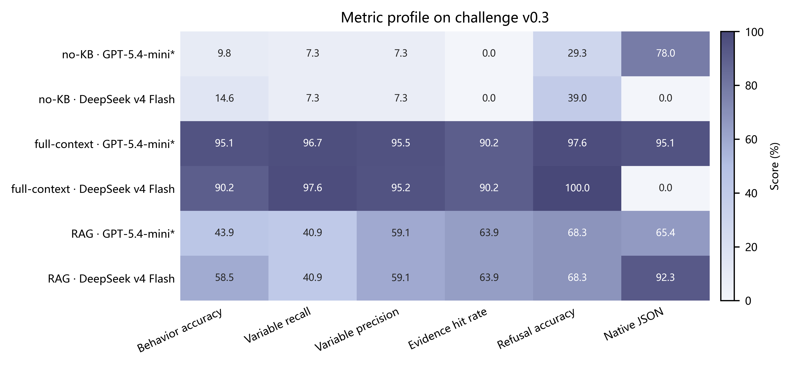

# STORM Raw API 知识库多模型测试报告

- 报告日期：2026-09-07
- 数据来源：已有正式评测与审计结果
- 本次操作：仅汇总、制表和绘图，未重新调用模型 API，不产生新增 API 费用
- 涉及模型：DeepSeek v4 Flash；GPT-5.4-mini（第三方中转站与 response.model 声明）

## 摘要

本报告把证据拆分为三个可解释层次：首先，在同一冻结的 challenge v0.3（41 题）上比较 GPT-5.4-mini 与 DeepSeek v4 Flash；其次，展示优化后 DeepSeek 在 challenge v0.6（60 题）上的 no-KB、full-context 和 RAG 回归对照；最后，依据 challenge v0.6 唯一一次首次盲测判断是否达到预先冻结的“有效 RAG”门槛。

核心结论：

1. 在严格同题集的 challenge v0.3 上，full-context 的行为准确率最高，GPT 为 95.12%，DeepSeek 为 90.24%；但 GPT 的平均延迟约为 DeepSeek 的 8.58 倍。
2. 同一旧版 RAG 条件下，DeepSeek 行为准确率为 58.54%，高于 GPT 的 43.90%。不过，两者变量召回率和证据命中率相同，差距明显受到模型调用错误与中转链路稳定性的影响，不能解释为纯模型能力差异。
3. 在优化后的 challenge v0.6 回归对照中，DeepSeek RAG 行为准确率达到 90.00%，相对 full-context 节省 89.95% Token，表现出明显的效果—成本优势。
4. challenge v0.6 唯一首次盲测仍有两个冻结门槛未通过：变量召回率 84.03% 低于 85%，原生 JSON 合规率 98.00% 低于 99%。因此正式结论仍是：**尚未达到全部有效 RAG 门槛**。

## 1. 实验条件的意义

| 条件 | 目的 | 能回答的问题 |
|---|---|---|
| no-KB | 不提供项目知识库 | 模型仅靠预训练知识能否识别 STORM 专用变量？ |
| full-context | 一次性提供完整知识上下文 | 有知识但不检索时的效果上界、长上下文稳定性和成本如何？ |
| RAG | 先检索相关变量与证据，再生成答案 | 能否用较小上下文同时保持变量映射、证据绑定和回答质量？ |

> **重要口径：** challenge v0.3 的跨模型 RAG 使用较早版本的检索实现；challenge v0.6 使用优化后的检索实现且只有 DeepSeek 结果。这两组不能直接用于推断“哪个模型在最新版 RAG 上更强”。

## 2. 同题集多模型比较：challenge v0.3

### 2.1 主结果表

| 条件 | 模型 | 行为准确率 | 变量召回率 | 证据命中率 | 总 Token | 平均延迟 | 模型错误 |
|---|---|---:|---:|---:|---:|---:|---:|
| no-KB | GPT-5.4-mini* | 9.76% | 7.32% | 0.00% | 198,979 | 57.58 s | 9 |
| no-KB | DeepSeek v4 Flash | 14.63% | 7.32% | 0.00% | 20,301 | 2.45 s | 10 |
| full-context | GPT-5.4-mini* | 95.12% | 96.75% | 90.24% | 1,313,524 | 29.76 s | 2 |
| full-context | DeepSeek v4 Flash | 90.24% | 97.56% | 90.24% | 1,214,822 | 3.47 s | 1 |
| RAG | GPT-5.4-mini* | 43.90% | 40.94% | 63.90% | 206,724 | 25.84 s | 9 |
| RAG | DeepSeek v4 Flash | 58.54% | 40.94% | 63.90% | 82,502 | 2.70 s | 2 |

**图 1 | 同题集多模型效果与成本比较。** a，GPT-5.4-mini 与 DeepSeek v4 Flash 在 no-KB、full-context 和 RAG 下的行为准确率。b，总 Token，采用对数坐标。c，平均调用延迟，采用对数坐标。所有面板均基于同一 challenge v0.3（n = 41）。星号表示 GPT 模型身份只能由第三方中转站配置和响应元数据声明，无法独立核验真实后端。

**图 2 | 多模型指标画像。** 单元格显示百分制结果，颜色越深表示指标越高。原生 JSON 一列受到配置差异影响：GPT 开启 JSON mode，而旧版 DeepSeek 对照的结构化输出机制不同，因此不能把这一列作为完全公平的模型能力排名。

### 2.2 结果解释

- **no-KB 均不可用。** 两个模型的行为准确率都低于 15%，证据命中率均为 0%，说明项目专用变量映射不能依赖模型记忆。
- **full-context 给出较高知识上界。** GPT 行为准确率为 95.12%，DeepSeek 为 90.24%；但完整上下文总 Token 均超过 120 万，且 GPT 延迟显著更高。
- **旧版 RAG 同时暴露检索和服务链路问题。** DeepSeek 行为准确率比 GPT 高 14.63 个百分点，但两者变量召回率同为 40.94%、证据命中率同为 63.90%；GPT 出现 9 个模型错误，DeepSeek 出现 2 个。因此差异不能简单归因为检索器或底层模型本身。

## 3. 优化后 DeepSeek 三条件：challenge v0.6

该实验属于 post-v0.6 regression，不是新的盲测。统一参数为 temperature=0、thinking=disabled、json_mode=true、max_output_tokens=3000、max_retries=0。

| 条件 | 行为准确率 | 变量召回率 | 变量精确率 | 证据命中率 | 原生 JSON | 总 Token | 模型错误 |
|---|---:|---:|---:|---:|---:|---:|---:|
| no-KB | 25.00% | 10.00% | 10.00% | 0.00% | 13.33% | 29,271 | 16 |
| full-context | 56.67% | 70.00% | 70.00% | 58.33% | 1.67% | 1,779,558 | 20 |
| RAG | 90.00% | 84.03% | 94.67% | 96.06% | 96.00% | 178,867 | 2 |

**图 3 | 优化后 DeepSeek 知识注入方案比较。** a，四项核心质量指标。b，总 Token，采用对数坐标。数据来自 challenge v0.6 的 60 题 post-regression，RAG 使用强调色。该实验用于回归和条件对照，不构成新的无偏泛化证据。

### 3.1 效果—成本分析

- RAG 行为准确率为 90.00%，比 full-context 高 33.33 个百分点，比 no-KB 高 65.00 个百分点。
- RAG 总 Token 为 178,867，比 full-context 的 1,779,558 少 89.95%；full-context Token 是 RAG 的 9.95 倍。
- full-context 出现 20 个模型错误和 39 次格式修复，说明“一次性塞入全部知识”并不等价于更稳定。
- RAG 的变量完全匹配率为 68.33%，低于变量精确率 94.67%，说明主要问题是多变量问题中的漏召回，而不是大量无关变量污染。

## 4. challenge v0.6 唯一首次盲测

| 指标 | 实测 | 冻结门槛 | 判定 |
|---|---:|---:|---|
| behavior_accuracy | 91.67% | ≥ 85.00% | 通过 |
| variable_hit_rate | 84.03% | ≥ 85.00% | **未通过** |
| variable_precision | 94.67% | ≥ 90.00% | 通过 |
| evidence_hit_rate | 96.06% | ≥ 90.00% | 通过 |
| refusal_accuracy | 98.33% | ≥ 90.00% | 通过 |
| native_json_compliance_rate | 98.00% | ≥ 99.00% | **未通过** |

**图 4 | 首次盲测实际值与冻结门槛。** 空心点表示预先定义的最低门槛，实心点表示实测值；绿色为通过，红色为未通过。challenge v0.6 共 60 题，只执行一次完整首次盲测，无 limit、无重试，冻结后未根据题集调整检索规则。

### 4.1 失分结构

- 变量召回率距离门槛差 0.97 个百分点；原生 JSON 合规率距离门槛差 1.00 个百分点。
- 60 道题中有 21 道存在至少一个问题；17 道被标记为检索欠召回，3 道出现歧义状态失败。
- 主要薄弱类型包括动态多变量族展开、公式依赖、SWM 多字段组合、跨层同名变量歧义，以及动作字段范围识别。

## 5. 可比性、限制与审稿风险

1. **模型身份限制。** GPT-5.4-mini 由第三方中转配置和 response.model 元数据声明，无法独立证明真实后端。
2. **结构化输出配置不完全一致。** challenge v0.3 跨模型对照中的 JSON mode 和格式修复策略并非完全同条件，原生 JSON 不适合作为单独的公平排名指标。
3. **网络和服务状态混入延迟。** 两模型评测日期和服务链路不同；延迟与错误率并非纯模型属性。
4. **RAG 是系统指标。** 变量召回、证据绑定、本地短路和 grounding 守卫包含检索器及规则贡献，不能全部归因于生成模型。
5. **缺少重复运行和不确定性估计。** 现有正式结果主要是单次固定题集运行，没有多随机种子、置信区间或方差，因此图中不绘制误差条。
6. **题集已经暴露。** challenge v0.6 在首次盲测后只能作为回归集；新的无偏泛化结论必须使用全新冻结题集，例如 v0.7。
7. **费用无法核算。** 接口未返回价格，estimated_cost_usd 为空不代表费用为零；本报告只比较 Token 和延迟。

## 6. 综合结论与建议

- **知识库必要性得到支持：** no-KB 在两个题集上均明显落后，无法完成有源码依据的变量问答。
- **RAG 是当前推荐的 Agent 知识注入方式：** 在优化后的 v0.6 回归中，RAG 同时提高行为准确率和证据命中率，并显著降低相对 full-context 的 Token 消耗。
- **尚不能宣布全面达到“有效 RAG”：** 唯一首次盲测有两项冻结门槛未通过。更准确的发布标签应为 conditional_go，或“内部可用、持续改进”。
- **下一步优先级：** 在非 challenge 开发集修复多变量完整召回、显式公式依赖展开和歧义状态判断；随后冻结全新 challenge v0.7，并只进行一次首次盲测。
- **后续公平多模型验证：** GPT 与 DeepSeek 应使用同一新冻结题集、同一 RAG 文件快照、相同 JSON 策略和重试上限，并保留可核验的响应模型元数据。

## 7. 附带数据与复现

| 文件 | 用途 |
|---|---|
| data/model_comparison_challenge_v0.3.csv | 同题集多模型指标 |
| data/deepseek_challenge_v0.6_three_conditions.csv | 优化后 DeepSeek 三条件指标 |
| data/challenge_v0.6_blind_thresholds.csv | 首次盲测门槛数据 |
| data/source_hashes.json | 三份源审计文件 SHA-256 |
| generate_report_figures.py | 重建 CSV 和全部图 |
| qa_notes.md | 图形契约、完整性与视觉 QA |

### 源数据 SHA-256

| 数据用途 | SHA-256 |
|---|---|
| challenge v0.3 跨模型比较 | B890B48DBBC2C3CFA7BCCC6E8D46CE774995786EE0A7CBD1AA3594F234575F50 |
| challenge v0.6 三条件回归 | 6275B6F6B99A617F9AEB41D6CD8E5306C592235D513B5AA6227B242428E37191 |
| challenge v0.6 首次盲测 | 37F148B1AD8B11FD3D52C485EABCD38B977953899026434A21EAE7F52D7D56A1 |

### 复现命令

在项目根目录运行以下命令：

    python knowledge/reports/multi_model_evaluation/generate_report_figures.py

该命令只读取已有评测 JSON，并覆盖本报告目录内的派生 CSV 和图片；不会调用外部模型 API。
